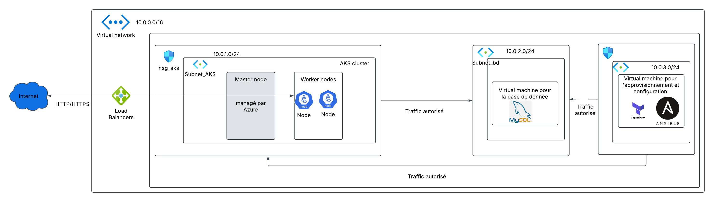

Project Architecture
This architecture deploys a containerized application on Azure Kubernetes Service (AKS) supported by a dedicated MySQL database running on a separate Virtual Machine.

The entire infrastructure is provisioned and configured using Terraform and Ansible from a dedicated management VM.

